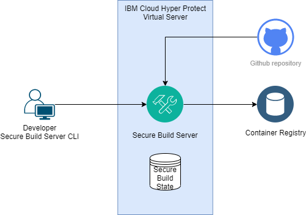

# WARNING: This repository is no longer maintained

> This repository will not be updated. The repository will be kept available in read-only mode.

## Using IBM Cloud Hyper Protect services to build an Edwards Curve signing server

## Overview

In this code pattern, you will learn how to build and run an example signing server application. The signing server application will provide example REST APIs to create signing keys, to sign data using an Edwards Curve signing mechanism and to verify signatures. The application will be deployed in a secure environment provided by IBM Cloud Hyper Protect Virtual Server, and it will integrate with IBM Cloud Hyper Protect Crypto Services and IBM Cloud Hyper Protect DBaaS to securely create, use and store private keys and other sensitive information. The signing server is implemented in Java on basis of Open Liberty.

You will use Hyper Protect services to securely build, deploy and run the signing server. The signing server will be made available in the public cloud for easy access, while maintaining protection of the signing server application and data, both in use and at rest. To achieve this high level of security, you will use IBM Cloud Hyper Protect Virtual Server Secure Build Server to build the signing server application image in a secure environment. You will then deploy and run the signing server in a secure enclave provided by IBM Cloud Hyper Protect Virtual Server. Consequently, even a cloud provider or administrator cannot access your build process, your build results, the signing server application or data.

The signing server will use the Enterprise PKCS #11 over gRPC (GREP11) API to create keys, sign data and verify signatures in a IBM Cloud Hyper Protect Crypto Services instance, and it will securely keep and store signing keys in a IBM Cloud Hyper Protect DBaaS MongoDB instance.

When you have completed this code pattern, you will understand how to:

- Use and invoke the Enterprise PKCS #11 over gRPC (GREP11) API from Java code

- Create an AES key encryption key for encrypting the private signing keys that are returned by the HPCS GREP 11 API and to securely store this key encryption key in the local file system of your IBM Cloud Hyper Protect Virtual Server instance

- How to store signing keys in a IBM Cloud Hyper Protect DBaaS instance

- Create an Apache Maven project to generate Java code for using the GREP11 API and to build the signing server web application

- Use the Secure Build Server to build the signing server application image

- Use IBM Cloud Hyper Protect Virtual Servers Bring Your Own Image (BYOI) to deploy the signing server application and run the signing server in a secure environment

To build this code pattern using Secure Build Server you will provision one IBM Cloud Hyper Protect Virtual Servers instance.

To run this code pattern, you will provision one IBM Cloud Hyper Protect Virtual Servers instance, one IBM Cloud Hyper Protect Crypto Services instance and one IBM Cloud Hyper Protect DBaaS for MongoDB instance.

## Use the Secure Build Server and IBM Cloud Hyper Protect Virtual Servers to securely build and deploy the signing server

You use the Secure Build Server to build a trusted container image within a secure enclave, which is provided by IBM Cloud Hyper Protect Virtual Servers. The enclave is highly isolated, which means that software developers must use a specific API to access the Secure Build Server. Neither cloud administrators nor the cloud provider can access the Secure Build Server in the secure enclave or it's contents, such as built container images and so on. The application image created by the Secure Build Server (together with the other relevant build output such as the manifest file and the encrypted registration file) is highly trusted. This is because the Secure Build Server cryptographically signs the application image and the manifest file and the signing keys are kept inside the secure enclaves.

Building a container image with Secure Build Server works as follows:
- Set up a Secure Build Server instance, then use the CLI to start the build on this instance.
- Secure Build Server pulls the source code from a GitHub repository, in this case from the signing server repository.
- Secure Build Server uses the source code's Dockerfile to build a container image.
- Secure Build Server signs the container image and pushes the container image to a container registry, such as IBM Container Registry or Docker Hub.
- Secure Build Server creates a manifest file and signs it. The manifest file is used to verify the source of the image and the integrity of the build. It contains the source code from which the image was built as well as the build log. You can download the manifest file from the Secure Build Server, and, for example, use it for audit purposes or pass it to an auditor. The manifest file is signed by signing keys that are kept inside the secure enclave.
- Secure Build Server creates an encrypted registration file, which can be used to provision an instance of the application on IBM Cloud Hyper Protect Virtual Servers using Bring Your Own Image (BYOI).


*Figure 1: The Secure Build Server*

The registration file specifies the container registry, the application image and the credentials required to access the container registry. The registration file is encrypted and can be decrypted by IBM Cloud Hyper Protect Virtual Servers only.

You can download and use the encrypted registration file yourself, or you can pass it to a cloud administrator who uses the registration file and the Hyper Protect Virtual Servers CLI to provision a IBM Cloud Hyper Protect Virtual Servers server instance with your image. The cloud administrator cannot access the information included in the registration file. In consequence – given access control is correctly setup for the container registry and the credentials are not exposed otherwise - the cloud administrator cannot download or access the application image and any secrets contained in the image.

## Prerequisites

To complete the following steps, you need to meet the following prerequisites:
- Create an IBM Cloud account that provides the required permissions to create and use a IBM Cloud Hyper Protect Crypto Services instance, a IBM Cloud Hyper Protect DBaaS for MongoDB instance, and IBM Cloud Hyper Protect Virtual Servers instances.
- Download and install the IBM Cloud CLI on your workstation

To setup a development environment on your workstation, you need to meet the following prerequisites:
- Install JDK 1.8 or newer
- Install Eclipse
- Install Apache Maven
- Install the gRPC compiler (https://developers.google.com/protocol-buffers)
- Install git

## Steps

During the following task flow, you will create
- one IBM Cloud Hyper Protect DBaaS for MongoDB instance
- one IBM Cloud Hyper Protect Crypto Services instance
- two IBM Cloud Hyper Protect Virtual Server instances: One instance for the Secure Build Server and one instance for the signing server application.

### Step 1: Create an API key for your user ID

Run the following command to create an API key for your user ID.
```
ibmcloud iam api-key-create myapikey -d "My API key"
```

The output displays the created API key. Note the `API Key` value, you need it later to provide the API Key when you login to IBM Cloud or set up the Secure Build Server. The following snippet shows example output:
```
Creating API key myapikey under <your account id> as <your user id>...
OK
API key myapikey was created

Please preserve the API key! It cannot be retrieved after it's created.

ID            ApiKey-...
Name          myapikey
Description   My API key
Created At    2021-...
API Key       xxxxxxxxxxxxxxxxxxxxxxxxxxxxxxxxxxxxxxxxxxx
Locked        false
```

### Step 2: Provision an instance of IBM Cloud Hyper Protect DBaaS for MongoDB

- Provision an instance of IBM Cloud Hyper Protect DBaaS for MongoDB by following the documentation
- Note the database name (by default, admin), your cluster name, the endpoint, and username and password
- Download the CA file
- Split and encode the downloaded CA file by running the following commands. You will need the resulting files `db_cert1.txt` and `db_cert2.txt` when provisioning the signing server instance later
```
csplit -s -z -f dbca cafile.pem '/-----BEGIN CERTIFICATE-----/' '{*}'
base64 -w 0 dbca00 > db_cert1.txt
base64 -w 0 dbca01 > db_cert2.txt
```

### Step 3: Provision and initialize an instance of IBM Cloud Hyper Protect Crypto Services

- Provision and initialize an instance of IBM Cloud Hyper Protect Crypto Services by following the documentation
- Note the instance id and the EP11 endpoint and port

### Step 4: Set up the IBM Container Registry

For this tutorial you need to set up IBM Container Registry and create a new namespace. The container registry is used to store the built application container image in the new namespace.

#### 1. Use the following commands to log in to IBM Cloud.
```
ibmcloud login --apikey <your api key>
ibmcloud target -g default
```

#### 2. Run the following commands to install the container registry CLI plugin and to create a new namespace `example` in your container registry.
```
ibmcloud plugin install container-registry
ibmcloud cr region-set us-south
ibmcloud cr namespace-add example
```

### Step 5: Clone the repository and setup a development environment to build the signing server application locally on your workstation

#### Clone the signing server repository
Clone the signing server repository locally. In a terminal, run:

```
git clone https://github.com/IBM/signingserver
```

#### Build the signing server application locally
To build the signing server application locally on your workstation:
- Make sure the gRPC compile protoc is included in your path, e.g. by running the following command:

```
export PATH="/path/bin:$PATH"
```

- Run the command following command in the signing server source folder:

```
mvn clean install
```

The Maven build comprises the following steps:
- It builds a submodule `source-generator`. This submodule contains a simple source code generator to generate EP11 and PKCS11 related constants.
- It runs this code generator to generate a class comprising said constants.
- It downloads the GREP11 proto file and invokes the gRPC compiler to compile this file.
- It compiles the source files including all the generated code.
- It creates the web application file `signing.war`

#### Run Docker Build to create a container image
Use the following command to build the signing server container image: 

```
docker build . -t signingserver
```

Use the following command to run the signingserver container. Specify the properties of your IBM Cloud Hyper Protect Crypto Services instance and IBM Cloud Hyper Protect DBaaS instance in form of environment variables.

```
docker run -it -p 9443:9443 -e API_KEY=<your api key> -e HPCS_PORT=<port> -e HPCS_INSTANCEID=<instance id> -e HPCS_ENDPOINT=<EP11 endpoint, e.g. ep11.us-east.hs-crypto.cloud.ibm.com> -e DB_USER=<your DB user id, e.g. admin> -e DB_PW=<your DB password> -e DB_URL=<your DB endpoint URL> -e DB_REPLICASET=<your DB cluster> -e DB_CERT1=<the content of file db_cert1.txt created in step2> -e DB_CERT2=<the content of file db_cert2.txt created in step 2> signingserver
```

### Step 6: Set up the Secure Build Server

Complete the steps in this procedure to set up the Secure Build Server.

#### 1. Install the IBM Cloud CLI HPVS plugin by running the following command:
```
ibmcloud plugin install hpvs
```

The Secure Build Server is written in Python and has been tested with Python 3.6.9. To set up the Secure Build Server, you need to install python3, pip3 and the Secure Build Server on your workstation.

#### 2. Install python3 and pip3, by running the following commands:
```
sudo apt-get update
sudo apt-get install python3 python3-pip
python3 -m pip install -U pip
```

Note: This tutorial shows the commands for Ubuntu. On other platforms please use the equivalent commands to install or update python3 and pip3.

#### 3. Use the following commands to install the Secure Build Server CLI on your workstation:
```
git clone git@github.com:ibm-hyper-protect/secure-build-cli.git
cd secure-build-cli
pip3 install -r requirements.txt
```

#### 4. Create the Secure Build Server configuration.
Create file `sbs-config.json` in your current working directory (this is the directory you created in the previous step, `secure-build-cli`), then add the following content:

```
{
  "CICD_PUBLIC_IP": "",
  "CICD_PORT": "443",
  "IMAGE_TAG": "1.3.0.3",
  "CONTAINER_NAME": "SBS",
  "GITHUB_KEY_FILE": "~/.ssh/id_rsa",
  "GITHUB_URL": "git@github.com:IBM/signingserver.git",
  "GITHUB_BRANCH": "main",
  "IMAGE_TAG_PREFIX": "s390x-v1",
  "REPO_ID": "sbs",
  "DOCKER_REPO": "example/signingserver",
  "DOCKER_USER": "iamapikey",
  "DOCKER_PASSWORD": "<your api key>",
  "DOCKER_RO_USER": "iamapikey",
  "DOCKER_RO_PASSWORD": "<your api key>",
  "DOCKER_CONTENT_TRUST_BASE": "False",
  "DOCKER_CONTENT_TRUST_BASE_SERVER": "",
  "DOCKER_BASE_SERVER": "us.icr.io",
  "DOCKER_PUSH_SERVER": "us.icr.io",
  "DOCKER_CONTENT_TRUST_PUSH_SERVER": "https://notary.us.icr.io",
  "ENV_WHITELIST":  [
      "API_KEY",
      "HPCS_INSTANCEID",
      "HPCS_ENDPOINT",
      "HPCS_PORT",
      "DB_URL",
      "DB_USER",
      "DB_PW",
      "DB_CERT1",
      "DB_CERT2",
      "DB_REPLICASET" ]
}
```

This file defines the configuration for your Secure Build Server instance, which you create in the next steps.

Notes:
- The property `CICD_PUBLIC_IP` is intentionally empty. This property is added later.
- The property `GITHUB_KEY_FILE` specifies the key file (on your workstation) that contains the SSH key for your GitHub account.
- The property `DOCKER_REPO` identifies the namespace (which you created in step 1) and the container image name to be used. Specify a value that is not used or allocated in your container registry.
- Specify the value of the API key created in step 1 for both properties `DOCKER_PASSWORD` and `DOCKER_RO_PASSWORD`

#### 5. Create the client certificate and client CA by running the following command:
```
# ./build.py create-client-cert --env sbs-config.json
```

The following snippet shows example output:
```
INFO:__main__:parameter file sbs-config.json renamed to sbs-config.json.2021-02-10_14-55-19.806993
INFO:root:client_certificate: generating client CA and certificate
```

The client certificate and CA is used for secure communication between the Secure Build Server CLI on your workstation and the Secure Build Server instance.

This command does the following:
- It updates the file `sbs-config.json` by adding two properties: `UUID` and `SECRET`.
- It creates a directory named `.SBS-<uuid>.d` to store the created certificate.

If the file `sbs-config.json` is open in an editor when you run this command, reload the updated file. Do not modify the new properties `UUID` and `SECRET`.

#### 6. Run the following command to display the client certificate and CA in base64-encoding:
```
# ./build.py instance-env --env sbs-config.json
```

The following snippet shows example output, including the base64-encoded values for `CLIENT_CRT` and `CLIENT_CA`, which you need in the next step:
```
INFO:root:client_certificate: using supplied pem files client_crt_key=.SBS-5f2bda44-b3f6-47d2-87d1-39e351ef9705 capath=./.SBS-5f2bda44-b3f6-47d2-87d1-39e351ef9705.d/client-ca.pem cakeypath=./.SBS-5f2bda44-b3f6-47d2-87d1-39e351ef9705.d/client-ca-key.pem
INFO:__main__:env="-e CLIENT_CRT=...  -e CLIENT_CA=..."
```

#### 7. Provision the Secure Build Server instance

First, copy the encrypted registration definition for the Secure Build image into a new file named `secure_build.asc`. The content of the encrypted registration definition is located [here](https://cloud.ibm.com/docs/hp-virtual-servers?topic=hp-virtual-servers-imagebuild#deploysecurebuild)

Then use the following command line to provision a new instance of the Secure Build Server. Insert the values for the environment variables `CLIENT_CRT` and `CLIENT_CA` taken from the output of the preceding command.
```
ibmcloud hpvs instance-create SBS lite-s dal13 --rd-path "secure_build.asc" -i 1.3.0.3 -e CLIENT_CRT=... -e CLIENT_CA=...
```

`SBS` defines the name of the instance to be created, `lite-s` is the pricing plan, and `dal13` is the location - you can use a different one. Be sure to use the image tag `1.3.0.3` as this references the up-to-date version of the Secure Build Server.
For more information about available pricing plans and regions and datacenters see [here](https://cloud.ibm.com/docs/hpvs-cli-plugin?topic=hpvs-cli-plugin-hpvs_cli_plugin#create_instance).

#### 8. Display your Secure Build Server instance.

To view information about the Secure Build Server instance and other HPVS instances you have provisioned, use the following command line:
```
ibmcloud hpvs instances
```
The command displays detailed information about the HPVS instances you have provisioned.

The following snippet shows example output for a Secure Build Server instance that is currently being provisioned:
```
Name                     SBS
CRN                      crn:v1:bluemix:public:hpvs:dal13:xxxxxxxxxxxxxxxxxxxxxxxxxxxxxxxxxx:xxxxxxxxxxxxxxxxxxxxxxxxxxxxxxxxxxxx::
Location                 dal13
Cloud tags
Cloud state              provisioning
. . .
Last operation           create in progress
Last image update        not available
Created                  not available
```

The following snippet shows example output for a Secure Build Server instance that is successfully provisioned and can be used for the next steps. Note the value of the property `Public IP address`:
```
Name                  SBS
CRN                   crn:v1:bluemix:public:hpvs:dal13:xxxxxxxxxxxxxxxxxxxxxxxxxxxxxxxxxx:xxxxxxxxxxxxxxxxxxxxxxxxxxxxxxxxxxxx::
Location              dal13
Cloud tags
Cloud state           active
Server status         running
Plan                  Free
Public IP address     <public IP address>
Internal IP address   <private IP address>
Boot disk             25 GiB
Data disk             25 GiB
Memory                2048 MiB
Processors            1 vCPUs
Image type            self-provided
Image OS              self-defined
Image name            ibmzcontainers/secure-docker-build:1.3.0.3
Environment           CLIENT_CA=...
                      CLIENT_CRT=...
Last operation        create succeeded
Last image update     -
Created               2021-...
```

#### 9. Complete the configuration file.

Edit the configuration file `sbs-config.json` to add the public IP address of your Secure Build Server instance as a value for property `CICD_PUBLIC_IP`:
```
"CICD_PUBLIC_IP": "<public IP Address>"
```

### Step 4: Build the signing server image using the Secure Build Server

Now, build the application container image.

#### 1. Check the status of your Secure Build Server instance.

Run the following command to check the status of your Secure Build Server instance:
```
./build.py status --env sbs-config.json --noverify
```

The following snippet shows example output. Here, the command completes successfully, and the `status` field is empty.
```
INFO:__main__:status: response={
    "status": ""
}
```

The following snippet shows example output for the case where the command does not complete successfully. This message typically indicates that the property `CICD_PUBLIC_IP` is not correctly set in the configuration file:
```
INFO:__main__:build: status e=Invalid URL 'https://:443/image': No host supplied
```

#### 2. Get the server CSR.

Run the following command to get the server CSR:
```
./build.py get-server-csr --env sbs-config.json --noverify
```

The following snippet shows example output including the server CSR:
```
INFO:__main__:get-server-csr: response={
    "csr": "-----BEGIN CERTIFICATE REQUEST-----\n...\n-----END CERTIFICATE REQUEST-----\n"
}
```
#### 3. Sign the server CSR.

Use the following command to sign the server CSR:
```
./build.py sign-csr --env sbs-config.json
```

This command does not display any output.


#### 4. Post the signed server certificate to your Secure Build Server instance.

To post the signed server certificate to your Secure Build Server instance, run the following command:
```
./build.py post-server-cert --env sbs-config.json --noverify
```

The following command shows example output, which indicates that the command completed successfully:
```
INFO:__main__:post-server-cert: response={
    "status": "OK"
}
```

#### 5. Check the status of your Secure Build Server instance.

To check and verify the status for your Secure Build Server instance, run the following command:
```
./build.py status --env sbs-config.json
```

The following command shows example output that contains the latest status message of your Secure Build Server instance:
```
INFO:__main__:status: response={
    "status": "restarted nginx"
}
```

#### 6. Initialize the configuration for your Secure Build Server instance.

Use the following command to initialize the configuration for your Secure Build Server instance:
```
./build.py init --env sbs-config.json
```

The following command shows example output of the command:
```
INFO:__main__:init: response={
    "status": "OK"
}
```

#### 7. Build the application image.

To build the application image, run the following command:
```
./build.py build --env sbs-config.json
```

This command starts the build on your Secure Build Server instance. It displays the following output:
```
INFO:__main__:build: response={
    "status": "OK: async build started"
}
```

#### 8. Check the status of your build.

Use the following command to display the status of your build:
```
./build.py status --env sbs-config.json
```

You can repeat this command to update the latest build status.

Here is example output displayed for a build which is in progress:
```
INFO:__main__:status: response={
    "build_image_tag": "1.3.0.3",
    "build_name": "",
    "image_tag": "",
    "manifest_key_gen": "",
    "manifest_public_key": "",
    "status": "github cloned"
}
```
Below is example output for a build which failed due to a container registry login problem:
```
INFO:__main__:status: response={
    "build_image_tag": "1.3.0.3",
    "build_name": "",
    "image_tag": "",
    "manifest_key_gen": "",
    "manifest_public_key": "",
    "root_ssh_enabled": false,
    "status": "exiting due to a non-zero return value: 1, cmd: docker login --username <USERNAME> --password <PASSWORD> docker.io"
}
```

#### 9. Check the build log.

To display the build log, run the following command:
```
./build.py log --log build --env sbs-config.json
```

This command displays the build log. You can repeatedly run this command during the build to see the latest updates to the build log.

#### 10. Wait until the build completes.

Run again the following command to display the status of your build:
```
./build.py status --env sbs-config.json
```

Here is example output for a build which completed successfully (indicated by the `success` status):
```
INFO:__main__:status: response={
    "build_image_tag": "1.3.0.3",
    "build_name": "us.icr.io.example.signingserver.s390x-v1-ad52e76.2021-02-10_15-37-37.178350",
    "image_tag": "s390x-v1-ad52e76",
    "manifest_key_gen": "soft_crypto",
    "manifest_public_key": "manifest.us.icr.io.example.signingserver.s390x-v1-ad52e76.2021-02-10_15-37-37.178350-public.pem",
    "status": "success"
}
```

Note the `image_tag` property. The image tag that was generated by the build based on the image tag prefix you defined in the configuration file. You use this image tag later to provision your application instance.

The Secure Build Server has now built successfully, signed your application's container image, and pushed it to the container registry (you can see the image with the image tag in your container registry `secureimages`). The Secure Build Server has also created a manifest file and an encrypted registration file, which you can use to provision the application instance.

### Step 7. Run the application in a secure environment

Now it's time to deploy and run your newly built application. To do so, you retrieve the encrypted registration file that was created during the build and use the  BYOI feature to provision a IBM Cloud Hyper Protect Virtual Server instance for your application.

#### 1. Retrieve the encrypted registration file

First, download the encrypted registration file for your application container image:
```
./build.py get-config-json --env sbs-config.json --key-id secure-build-ad52e76-1
```

The command creates a GPG key to sign the file. The parameter `key-id` is used to generate the key UID. Provide a unique value comprising the image tag retrieved in step 3, like e.g. `secure-build-ad52e76-1`:

While the command runs, you are asked multiple times for a passphrase. First, enter the passphrase twice for key creation, then again to sign the file.

The command creates the file `sbs.enc` file in your current directory and prints the following output:
```
INFO:__main__:a json config file has been written to sbs.enc.
```

The encrypted registration file `sbs.enc` contains the information that is used by HPVS to provision a server instance with your application's container image. The file includes the repository_name as well as the container registry credentials. As the file is encrypted, you can pass it on to a cloud administrator (for example to provision the service instance) without exposing this information.

#### 2. Create the IBM Cloud Hyper Protect Virtual Servers instance for your application.

Use the Bring Your Own Image (BYOI) feature to provision a IBM Cloud Hyper Protect Virtual Server instance for your application container image. To do so, you need the image tag from step 10.

Run the following command and specify the properties of your IBM Cloud Hyper Protect Crypto Services instance and IBM Cloud Hyper Protect DBaaS instance in form of environment variables.

```
image_tag=s390x-v1-ad52e76
ibmcloud hpvs instance-create signingserver lite-s dal13 --rd-path sbs.enc -e API_KEY=<your api key> -e HPCS_PORT=<port> -e HPCS_INSTANCEID=<instance id> -e HPCS_ENDPOINT=<EP11 endpoint, e.g. ep11.us-east.hs-crypto.cloud.ibm.com> -e DB_USER=<your DB user id, e.g. admin> -e DB_PW=<your DB password> -e DB_URL=<your DB endpoint URL> -e DB_REPLICASET=<your DB cluster>  -e DB_CERT1=<the content of file db_cert1.txt created in step2> -e DB_CERT2=<the content of file db_cert2.txt created in step 2> signingserver -i $image_tag
```

`signingserver` defines the name of the instance to be created, `lite-s` is the pricing plan, and `dal13` is the location - you can use a different values for these parameters.

This command starts instance provisioning and displays the following output:

```
OK
Provisioning request for service instance 'crn:v1:bluemix:public:hpvs:dal13:xxxxxxxxxxxxxxxxxxxxxxxxxxxxxxxxxx:xxxxxxxxxxxxxxxxxxxxxxxxxxxxxxxxxxxx::' was accepted.
 To check the provisioning status run:
 ibmcloud hpvs instance crn:v1:bluemix:public:hpvs:dal13:xxxxxxxxxxxxxxxxxxxxxxxxxxxxxxxxxx:xxxxxxxxxxxxxxxxxxxxxxxxxxxxxxxxxxxx::
```

Use the command listed in the output to check the provisioning status of your service instance:

```
ibmcloud hpvs instance crn:v1:bluemix:public:hpvs:dal13:xxxxxxxxxxxxxxxxxxxxxxxxxxxxxxxxxx:xxxxxxxxxxxxxxxxxxxxxxxxxxxxxxxxxxxx::
```

Wait until your service instance is successfully provisioned. After the HPVS instance is provisioned, you can view it in your IBM Cloud resource list.

The `ibmcloud hpvs instance` command prints detailed information about the instance including it's public IP address. Note this IP address and proceed to the final step of our tutorial.

## Use the application

The signing server provides a REST API through https port 9443. You can use your favorite REST or HTTP client to invoke the REST API or invoke the REST API from command line, as shown in the following examples:

#### Create a key pair
```
curl -k --request POST \
  --url https://<ip>:9443/signing/api/v1/keys \
  --header 'Content-Type: application/json' \
  --data '{}'
```

This returns the id of the newly created key pair and the public key, e.g.
 
```
{
  "id": "8b3e7169-e4a1-44cc-acf4-c3c4875f4fa2",
  "pubKey": "MDMwDgYHKoZIzj0CAQYDK2VwAyEAsHtbz13QHnkPo5SmJQwMspdondonpynz8uZL0H2kh8gEEIENW1JUYG6OY1RhMegDF5IEIAAAAAAAAAAAAAAAAAAAAAAAAAAAAAAAAAAAAAAAAAAABAjQujMWgq+6zAQIAAAAAAAAAAEEFBABAAAAAYCAAAGAgIABAAoAAAABBCCusExibgcS68di35VhGjL1aA0IQvO90mrhvXrXlteuew=="
}
```

#### Sign data

Specify the id of a previously generated key and base64-encoded data to be signed:

```
curl -k --request POST \
  --url https://<ip>:9443/signing/api/v1/sign \
  --header 'Content-Type: application/json' \
  --data '{
	"data" : "SGFsbG8gZGFzIGlzdCBlaW4gVGVzdA==",
	"id": "8b3e7169-e4a1-44cc-acf4-c3c4875f4fa2"
}'
```

This returns the base64-encoded signature in plain text, e.g.:

```
vSqKTh693H8FC3Qwt2PP/sUIIqndOtGEi4bcPIddbWAt/0eT2HWa5o9RMidS4/74e0XMpC5JW4IztCDsZRyWBg==
```

#### Verify signature

Specify the key id, the base-64 encoded data and the base64-encoded signature to be verified:

```
curl -k --request POST \
  --url https://<ip>:9443/signing/api/v1/verify \
  --header 'Content-Type: application/json' \
  --data '{
	 "id": "8b3e7169-e4a1-44cc-acf4-c3c4875f4fa2",
	"data" : "SGFsbG8gZGFzIGlzdCBlaW4gVGVzdA==",
	"signature" : "vSqKTh693H8FC3Qwt2PP/sUIIqndOtGEi4bcPIddbWAt/0eT2HWa5o9RMidS4/74e0XMpC5JW4IztCDsZRyWBg=="
	
}'
```

If the verification is successfuly this API returns response status code 200

```
curl -k --request POST \
  --url https://<ip>:9443/signing/api/v1/verify \
  --header 'Content-Type: application/json' \
  --data '{
	 "id": "8b3e7169-e4a1-44cc-acf4-c3c4875f4fa2",
	"data" : "BGFsbG8gZGFzIGlzdCBlaW4gVGVzdC==",
	"signature" : "vSqKTh693H8FC3Qwt2PP/sUIIqndOtGEi4bcPIddbWAt/0eT2HWa5o9RMidS4/74e0XMpC5JW4IztCDsZRyWBg=="
	
}'
```

If the verification fails, the API returns response error code 500.
